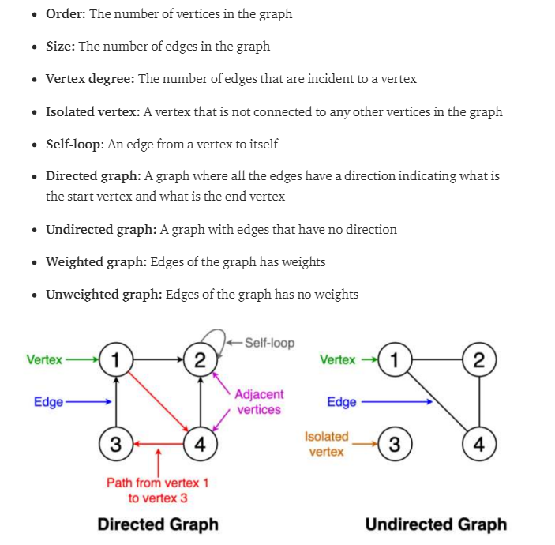

# Algorithms

## Concepts

-   #### Brute force

    -   Brute Force is a way to find the correct solutions by checking all the possible solutions.
    -   Ideal for solving small, simpler problems.
    -   But for large problems, this can be inefficient & slow.

-   #### Divide & Conquer [(view)](https://www.youtube.com/watch?v=YOh6hBtX5l0)

    -   This concept can divide into 3 parts,
        1. Divide - divide problem into sub-problems
        2. Conquer - Solve sub-problems recursively until solved.
        3. Combine - combine solved sub-problems to get the final solution.
    -   
    -   Divide & Conquer vs Dynamic Programming:
        -   D&C should be used when the same sub-problems are not evaluated many times
        -   Otherwise DP/memoization.
    -   Advantages:
        -   Parallelism: Sub-problems can be solved parallelly.
        -   Memory access: sub-problems are small enough to solve in cache, which is fast than main-memory. So it's a [cache oblivious algorithm](https://www.geeksforgeeks.org/cache-oblivious-algorithm/)
    -   Disadvantages:

        -   Complexity - Dividing a problem into smaller sub-problems can increase the complexity.
        -   Memory limitations - On larger dataset, storing results of sub-problems can be a limiting factor.

    -   Applications:
        -   Merge, Quick sort
        -   Strassen’s Algorithm
        -   binary search

-   #### Dynamic Programming [(View)](https://github.com/RukshanDias/Dynamic-Programming)

    -   A programming technique where an algorithmic problem is first broken down into sub-problems, & sub-problems are use to find the optimal solution.

    -   Memoization - store duplicate sub problems, so it can be reused when it occurs again.

    -   Applications: Fibonacci series

-   #### Backtracking
    -   Backtracking is an algorithm that use **brute force** approach to find the desired output.
    -   If the current solution is not suitable, then backtrack and try other solutions. This involves **Recursion**.
    -   Backtracking vs Dynamic Programming:
        -   Use BT if the problem have multiple solutions.
        -   If there's an optimal solution go for DP.
            
    -   Types of Backtracking:
        -   Decision problem: search for a feasible solution.
        -   Optimization problem: search for the best solution.
        -   Enumeration problem: find all feasible solutions.
    -   Applications:
        -   n-queen problem
        -   The Knight's tour problem.

---

## 1. Two Pointers

-   This technique is used for searching pairs in a sorted array.
-   Behavior of algorithm:
    -   Q: find any numbers that sum is 50.
    1. set two pointers, one on the 0th index & one on the last index.
    2. Get the sum of 2 nums which're in pointers.
    3. if sum>50 ? reduce right/high pointer from 1 index : else, increase left/low pointer from 1 index.
    4. again check sum & continue.
-   

## 2. Sliding Window [(view)](https://www.youtube.com/shorts/3V8YcmxtRLQ)

-   Q: from the given array which of 4 length has the highest sum.
    -   here instead of calculating the values if index [0 1 2 3], [1 2 3 4], [2 3 4 5], ...
    -   we can **reduce** the removing value & **add** the new value.
    -   This can be very efficient when the window length gets larger.
-   
-   Where to use Sliding Window:
    -   Array, sub-array
    -   String, sub-string
    -   maximum sum, minimum sum

## 3. K-Way merge [(view)](https://www.youtube.com/watch?v=vO961e332A4)

-   Falls under merge algos.
-   Used to merge multiple sorted arrays into one sorted array.
-   This algo will use the concept of divide & conquer.
-   Behavior of algorithm:
    1. Get the main array that contains K number of arrays.
    2. Divide the array into individual arrays.
    3. Couple 2 arrays and start comparing.
        - a pointer on 0th index of each 2 arrays.
        - Compare which val is smaller, & select it.
        - increase the index of selected array.
        - Continue & get the final sorted array.
    4. Combine the reset of arrays 2 by 2 & get the final sorted array.

## 4. Sorting algorithms [(view)](https://www.geeksforgeeks.org/sorting-algorithms/)

-   A method to reorganizing number of items into a specific order.
-   Top 5 sorting algos:
    1. Bubble sort
    2. Insertion sort
    3. Selection sort
    4. Merge sort
    5. Quick sort

## 5. Graph algorithms

-   [view article](https://towardsdatascience.com/10-graph-algorithms-visually-explained-e57faa1336f3)
-   **What's a Graph?**
    - A graph consists of a set of vertices/nodes and a set of edges connecting these vertices.
    - 

#### 1. BFS

#### 2. DFS

#### 3. Dijkstra algorithm

#### 4. Floyd Warshall Algorithm

#### 5. Bellman-Ford Algorithm

#### 6. Prim’s algorithm

#### 7. Kruskal’s algorithm

## 6. Shortest-path algorithms

## 7. Greedy algorithms
